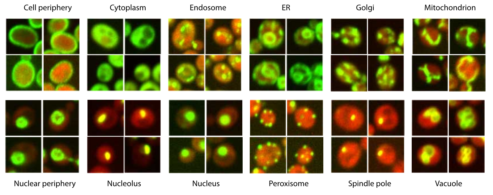

# DeepYeast

This repository contains re-implemented code for the paper [Accurate classification of protein subcellular localization from high throughput microscopy images using deep learning](http://www.g3journal.org/content/7/5/1385), and additional experiments with new model architectures and optimization tricks.

# Installation

To install from the GitHub source, download the project:

```sh
git clone https://github.com/tanelp/deepyeast.git
```

Then, move to the folder and run the install command:

```sh
cd deepyeast
python setup.py install
```

# Data

The models are trained on high-throughput proteomescale microscopy images. Each image has two channels: a red fluorescent protein (mCherry) with cytosolic localization, thus marking the cell contour, and green fluorescent protein (GFP), tagging an endogenous gene in the 3' end, and characterizing the abundance and localization of the protein. The data are split into 65,000 examples for training, 12,500 for validation and 12,500 for testing.



```python
from deepyeast.dataset import load_data

x_train, y_train = load_data('train')
x_val, y_val = load_data('val')
x_test, y_test = load_data('test')
```
### Transfer learning data

`Transfer learning data` have four new categories (actin, bud neck, lipid particle, microtubule) and can be used to assess the generality of features learned in the classification task. Each category contains 1,000 cell images for training, 500 for validation and 1,000 for testing.

```python
from deepyeast.dataset import load_transfer_data

x_train, y_train = load_transfer_data('train')
x_val, y_val = load_transfer_data('val')
x_test, y_test = load_transfer_data('test')
```

* Explore class counts, splits into training/validation/test, and class examples for the [main dataset](http://kodu.ut.ee/~leopoldp/2016_DeepYeast/reports/data_overview.html), and the [transfer learning dataset](http://kodu.ut.ee/~leopoldp/2016_DeepYeast/reports/transfer_data_overview.html).

# Models

| Model | Top-1 train accuracy | Top-1 val accuracy | Top-1 test accuracy| Link | MD5 Checksum |
| --- | --- |--- | --- | --- | --- |
| DeepYeast | 0.96 |0.90 | 0.89 |[Download](https://github.com/tanelp/deepyeast/releases/download/v0.1/deepyeast-weights-22-0.902.hdf5)|`c42d8788ba006f9c82725fffe3b096b6` |
| ResNet | 0.99 |0.89 | * | - | - |
| MobileNet | 0.99 |0.86 | * | - | - |
| DenseNet | 0.95 |0.87 | * | - | - |

* hyperparameters have not been well tuned for these models, therefore test accuracy has not been evaluated.

### Classification

Classify a new image with the pre-trained DeepYeast network.

```python
from deepyeast.dataset import load_data
from deepyeast.utils import preprocess_input, decode_predictions
from deepyeast.models import DeepYeast

x_test, y_test = load_data("test")
x = x_test[[0]]
x = preprocess_input(x)

model = DeepYeast()
weights_path = '/path/to/weights.hdf5'
model.load_weights(weights_path)
preds = model.predict(x)

print(decode_predictions(preds))
#[[('nuclear periphery', 0.96398586), ('nucleolus', 0.016439179), ...
```

### Feature extraction

Extract features from the first fully connected layer of the DeepYeast model.

```python
from deepyeast.dataset import load_data
from deepyeast.utils import preprocess_input, create_feature_extractor
from deepyeast.models import DeepYeast

x_test, y_test = load_data('test')
x = x_test[[0]]
x = preprocess_input(x)

model = DeepYeast()
model.summary() # see feature names
ip1_extractor = create_feature_extractor(model, layer_name="ip1")

ip1_features = ip1_extractor.predict(x)
```

### Fine-tuning

Fine-tune the DeepYeast model on the transfer learning data.

```python
import keras
from keras.layers import Dense
from keras.models import Model

from deepyeast.dataset import load_transfer_data
from deepyeast.utils import preprocess_input
from deepyeast.models import DeepYeast

# import transfer learning data
x_train, y_train = load_transfer_data('train')
x_val, y_val = load_transfer_data('val')

# convert class vectors to binary class matrices
num_classes = 4
y_train = keras.utils.to_categorical(y_train, num_classes)
y_val = keras.utils.to_categorical(y_val, num_classes)

# transform input images to [-1, 1]
x_train = preprocess_input(x_train)
x_val = preprocess_input(x_val)

# load pre-trained network
base_model = DeepYeast()
weights_path = '/path/to/weights.hdf5'
base_model.load_weights(weights_path)

# add a new classification head
relu5_features = base_model.get_layer('relu5').output
probs = Dense(4, activation='softmax')(relu5_features)
model = Model(inputs=base_model.input, outputs=probs)

# fine-tune only fully-connected layers, freeze others
for layer in model.layers[:26]:
    layer.trainable = False

model.compile(loss=keras.losses.categorical_crossentropy,
              optimizer=keras.optimizers.SGD(lr=0.0001, momentum=0.9, nesterov=True),
              metrics=['accuracy'])

model.fit(x_train, y_train,
          batch_size=64,
          epochs=100,
          validation_data=(x_val, y_val))
```

### Training

Train a new model architecture on the DeepYeast data.

```python
import keras
from deepyeast.dataset import load_data
from deepyeast.utils import preprocess_input
from deepyeast.models import DeepYeast

# 1. set up data
x_val, y_val = load_data("val")
x_test, y_test = load_data("test")

num_classes = 12
y_val = keras.utils.to_categorical(y_val, num_classes)
y_test = keras.utils.to_categorical(y_val, num_classes)

x_train = preprocess_input(x_train)
x_val = preprocess_input(x_val)

# 2. set up model
model = DeepYeast()

model.compile(loss=keras.losses.categorical_crossentropy,
              optimizer=keras.optimizers.Adam(),
              metrics=['accuracy'])

filepath="../weights-{epoch:02d}-{val_acc:.3f}.hdf5"
checkpoint = keras.callbacks.ModelCheckpoint(filepath, monitor='val_acc', verbose=1, save_best_only=True, mode='max')
reduce_lr = keras.callbacks.ReduceLROnPlateau(monitor='val_acc', factor=0.1, patience=5, cooldown=0, min_lr=1e-5)
callbacks_list = [checkpoint, reduce_lr]

# 3. training loop
batch_size = 64
epochs = 300
model.fit(x_train, y_train,
          batch_size=batch_size,
          epochs=epochs,
          validation_data=(x_val, y_val),
          callbacks=callbacks_list)

```

### Evaluating the performance

Evaluate model's performance on the test set.

```python
python evaluate.py deepyeast weights/deepyeast-weights-22-0.902.hdf5
```

# Other examples
### Data augmentation

The package includes an implementation of the recent data augmentation technique [mixup](examples/train_deepyeast_with_mixup.py).

### Learning rate finder

Don't know how to choose a learning rate? [Learning rate range test](examples/learning_rate_finder.py) gives a reasonable starting point.

### Visual explanations

Why did the model make such a prediction? Use [gradient class activation maps](examples/grad_cam.py) to see where the model attends to.

# Citing

If you find the code helpful, please consider citing the paper [Accurate classification of protein subcellular localization from high throughput microscopy images using deep learning]().

BibTeX entry:

```latex
@article{parnamaa2017accurate,
  title={Accurate Classification of Protein Subcellular Localization from High-Throughput Microscopy Images Using Deep Learning},
  author={P{\"a}rnamaa, Tanel and Parts, Leopold},
  journal={G3: Genes, Genomes, Genetics},
  volume={7},
  number={5},
  pages={1385--1392},
  year={2017},
  publisher={G3: Genes, Genomes, Genetics}
}
```

If you use the data, please also cite [Yeast proteome dynamics from single cell imaging and automated analysis](https://www.ncbi.nlm.nih.gov/pubmed/26046442).

BibTeX entry:

```latex
@article{chong2015yeast,
  title={Yeast proteome dynamics from single cell imaging and automated analysis},
  author={Chong, Yolanda T and Koh, Judice LY and Friesen, Helena and Duffy, Supipi Kaluarachchi and Cox, Michael J and Moses, Alan and Moffat, Jason and Boone, Charles and Andrews, Brenda J},
  journal={Cell},
  volume={161},
  number={6},
  pages={1413--1424},
  year={2015},
  publisher={Elsevier}
}
```
# License

MIT
